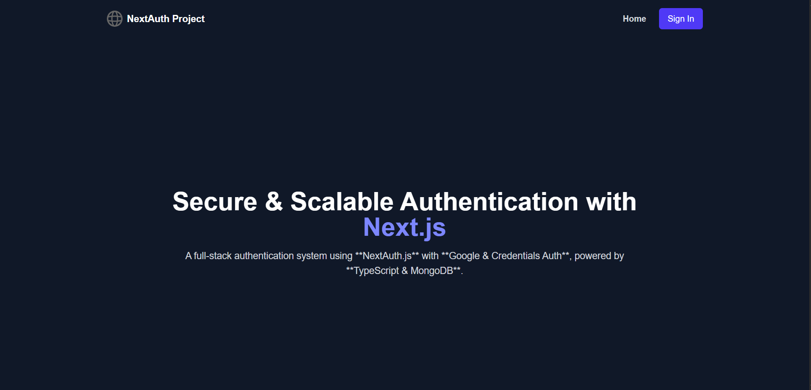
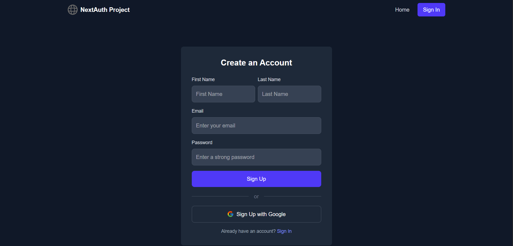
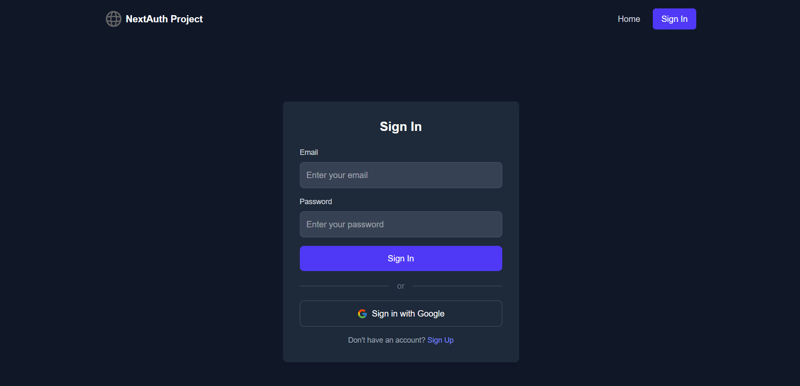
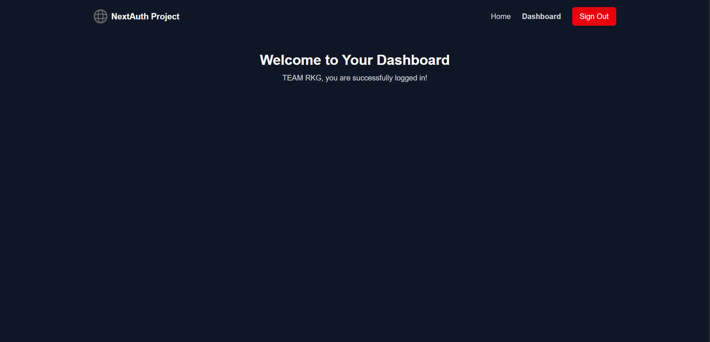

# **🚀 Next.js Authentication Template with NextAuth.js, TypeScript, and MongoDB**  
A **full-stack authentication system** using **Next.js**, **NextAuth.js**, **TypeScript**, and **MongoDB**, featuring **Google OAuth & Credentials Authentication**. This template provides **secure, scalable, and production-ready authentication** for your Next.js projects.  

🔗 **Live Demo:** [https://nextjs-auth-kappa-five.vercel.app/](https://nextjs-auth-kappa-five.vercel.app/)

☕ **Support My Work:** [Buy Me a Coffee](https://payments.cashfree.com/links?code=W88lv9de14g0)
---

## **✨ Features**  
✅ **NextAuth.js Authentication** (Google OAuth + Credentials)  
✅ **User Data Stored in MongoDB** (First Name, Last Name, Email, Image)  
✅ **Beautiful UI with Tailwind CSS** (Responsive, Dark Mode Support)  
✅ **Protected Dashboard Page** (Only Logged-In Users Can Access)  
✅ **Session Management** (JWT-based Sessions)  
✅ **Automatic User Creation on Google Sign-In**  
✅ **Redirect Users After Login** (To `/dashboard`)  

---

## **📌 Technologies Used**  
- **Framework:** Next.js 14 (App Router)  
- **Authentication:** NextAuth.js  
- **Database:** MongoDB with Mongoose  
- **Styling:** Tailwind CSS  
- **State Management:** React Hooks (`useSession`)  
- **Deployment:** Vercel  

---

# **📖 Installation Guide**  

## **🚀 Step 1: Clone the Repository**  
```bash
git clone https://github.com/rkgcode/nextjs-auth.git
cd nextjs-auth
```

---

## **⚙️ Step 2: Install Dependencies**  
```bash
npm install
```

---

## **🛠 Step 3: Configure Environment Variables**  
Create a `.env.local` file in the root directory and add the following values:  

```env
# MongoDB Connection
MONGODB_URI=mongodb+srv://your_mongodb_connection_string

# NextAuth Secret Key
NEXTAUTH_SECRET=your_random_secret_key

# NextAuth URL
NEXTAUTH_URL=http://localhost:3000

# Google OAuth Credentials
GOOGLE_CLIENT_ID=your_google_client_id
GOOGLE_CLIENT_SECRET=your_google_client_secret
```
> **🔹 Note:** Replace `your_mongodb_connection_string`, `your_google_client_id`, and `your_google_client_secret` with actual values.

---

## **🛠 Step 4: Set Up Google OAuth**  
1️⃣ **Go to** [Google Cloud Console](https://console.cloud.google.com/)  
2️⃣ **Create a new OAuth Client ID**  
3️⃣ **Set "Authorized Redirect URIs" to:**  
   - **Local:** `http://localhost:3000/api/auth/callback/google`  
   - **Production:** `https://yourdomain.com/api/auth/callback/google`  
4️⃣ **Copy the `Client ID` and `Client Secret` and update `.env.local`**  

---

## **💻 Step 5: Run the Development Server**  
```bash
npm run dev
```
🔹 **Your app is now running on** `http://localhost:3000`

---

# **📂 Folder Structure**
```
📦 nextjs-auth
├── 📂 app
│   ├── 📂 api
│   │   ├── 📂 auth
│   │   │   ├──📄 [...nextauth]/route.ts  # NextAuth API Route
│   │   │   ├──📄 sign-in/route.ts
│   ├── 📂 auth
│   │   ├── 📄 sign-in/page.tsx  # Sign-In Page
│   │   ├── 📄 sign-up/page.tsx  # Sign-Up Page
│   ├── 📂 components
│   │   ├── 📄 Navbar.tsx  # Navigation Bar
│   ├── 📂 dashboard
│   │   ├── 📄 page.tsx  # Protected Dashboard Page
│   ├── 📂 lib
│   │   ├── 📄 auth.ts  # NextAuth Configuration
│   │   ├── 📄 db.ts  # Database Connection
│   ├── 📂 models
│   │   ├── 📄 User.ts  # Mongoose User Schema
│   ├── 📄 favicon.ico
│   ├── 📄 globals.css
│   ├── 📄 layout.tsx  # Root Layout
│   ├── 📄 page.tsx  # Home Page
│   ├── 📄 Providers.tsx  # Home Page
├── 📂 public
├── 📄 .env.local  # Environment Variables
├── 📄 .gitignore
├── 📄 eslint.config.mjs
├── 📄 next-env.d.ts
├── 📄 next.config.ts  # Next.js Configuration
├── 📄 package-lock.json
├── 📄 package.json
├── 📄 postcss.config.mjs
├── 📄 README.md
├── 📄 tsconfig.json
```

---

# **🔑 Authentication Flow**
✔ **Sign Up (Credentials):** User creates an account → Stored in MongoDB → Redirected to `/dashboard`.  
✔ **Sign In (Credentials):** User logs in → JWT session created → Redirected to `/dashboard`.  
✔ **Sign In (Google OAuth):** User logs in via Google → If first-time login, stored in MongoDB → Redirected to `/dashboard`.  

---

# **📌 API Routes**

| Route                        | Method | Description                        |
|------------------------------|--------|------------------------------------|
| `/api/auth/sign-up`         | `POST` | Sign up a new user               |
| `/api/auth/[...nextauth]`           | `POST` | Sign in a user                    |

---

# **🖥 UI Screenshots**
🚀 **Home Page:**  
 

🚀 **Signup Page:**  
 

🚀 **Signin Page:**  
  

🚀 **Dashboard Page:**  
  

---

# **🚀 Deployment Guide**
## **🔹 Deploy on Vercel**
1. **Push your project to GitHub**
   ```bash
   git add .
   git commit -m "Initial commit"
   git push origin main
   ```
2. **Go to** [Vercel](https://vercel.com/) and create a new project  
3. **Import your GitHub repository**  
4. **Add environment variables in Vercel (`.env.local` values)**  
5. **Deploy & Access Your Live App! 🎉**  

---

# **🙌 Contributing**
💡 **Want to improve this project?**  
Feel free to submit a **Pull Request** or open an **Issue**! 🚀  

---

# **📜 License**
This project is **MIT Licensed**. Feel free to use and modify it.  

---

# **📞 Need Help?**
💬 **Contact Me:** [contact.teamrkg@gmail.com]  
🌐 **Portfolio:** [www.imgram.in]  

---

### **🚀 Now You Have a Fully Functional Next.js Auth Template!**  
Let me know if you need any changes! 😊🚀